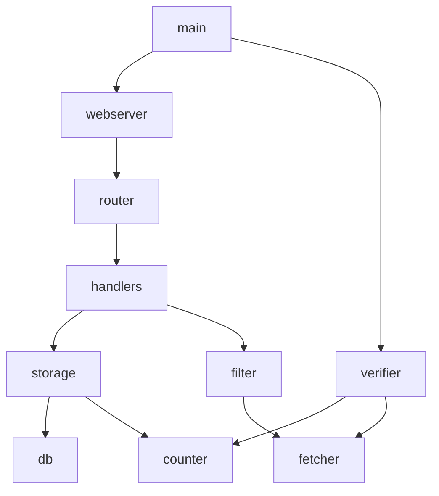

[](https://github.com/dmytro-vovk/shta/actions/workflows/ci.yaml)
[](https://github.com/dmytro-vovk/shta/actions/workflows/lint.yaml)
[](https://github.com/dmytro-vovk/shta/actions/workflows/tests.yaml)

[](https://github.com/dmytro-vovk/shta/actions/workflows/openapi.yaml)
[](https://github.com/dmytro-vovk/shta/actions/workflows/dependabot/dependabot-updates)

# Spamhaus Test Assignment

Spamhaus test assignment (details [here](ASSIGNMENT.md)).

## How to run

```shell
make start
```

Then, API will be exposed at `http://localhost:8080`.

Endpoints:
 - `GET /v1/urls` -- returns list of last 50 URLs, supports optional `sort` and `order` parameters. 
 - `POST /v1/urls` -- adds new or updates existing URL from request body.

Full API specification can be found in file [openapi.yaml](openapi.yaml).

### Adding a new URL

Send POST request to `/v1/urls` endpoint with request body containing URL.
```shell
curl -d 'https://example.com/' -X POST http://localhost:8080/v1/urls
```
### Fetching top URLs

Send GET request to `/v1/urls` endpoint, with optional parameters:

```shell
curl 'http://localhost:8080/v1/urls?sort=frequency&order=desc'
```

After testing, shut it down:

```shell
make stop
```

## Make targets

- `make build` -- triggers building of Go binary.
- `make start` -- spins up a set of docker containers to run the app and its dependencies.
- `make watch` -- same as `start` but it does not detach from terminal, allowing to read logs.
- `make stop` -- shuts down docker containers start by `make start` command.
- `make restart` -- executes `stop` and `start` commands sequentially.
- `make clean` -- performs docker system prune, removing stopped & unused stuff.
- `make lint` -- runs Go metalinter using config `.golangci.yml`.
- `make test` -- runs tests of all packages three times with data race detection and coverage output.
- `make coverage` -- generates test coverage badge (`coverage.svg`).

## Configuration

A sample config file `config.yml` provided containing all the parameters with their default values.

Container environment values are location in file `docker-compose.yml`.

Also, the app supports environment variables for each parameter, for reference see [/internal/boot/config/config.go](./internal/boot/config/config.go)

## Logging

The app writes unstructured logs in plain text format to `STDERR`.
It would make sense to use `slog` package to implement structured logging with support of log levels. 

## Testing

Some of the packages are covered with unit tests. 
The ones not covered are either copied from other projects where they have proven themselves to be reliable (e.g. `boot`),
or are very simple, having single execution path (like `web`). In this case code quality is validated by running integration tests
(not implemented as code). 

## Repository

The repo has Ci workflow that ensures cleanliness of the code, passing tests, build-ability.

Also, there are checks for outdated dependencies provided by Dependabot. 

## Architecture



### Packages
Packages located in `internal` directory to make them non-importable outside this repository.

 - `boot` -- manages dependencies and launches the app.
 - `boot/config` -- handles loading and parsing app config.
 - `counter` -- in-memory counter of submitted URLs.
 - `db` -- provides access to PostgreSQL database. 
 - `fetcher` -- a service to download URLs with built-in concurrency limit.
 - `filter` -- verifies submitted URLs for liveness and decides whether to store them or discard. 
 - `periodic` -- task to periodically check top URLs for liveness.
 - `storage` -- provides access to storing/retrieving URLs.
 - `types` -- contains shared types.
 - `web` -- provides HTTP server.
 - `web/handlers` -- set of HTTP handlers for API endpoints.

### Bill of Materials

Software:
- PostgreSQL RDMS, containerised.

External libraries:
- `github.com/dmytro-vovk/envset` -- setting config values from environment (license: MIT). 
- `github.com/jmoiron/sqlx` -- extension for efficient work with SQL databases (license: MIT).
- `github.com/lib/pq` -- PostgreSQL driver (license: MIT).
- `github.com/stretchr/testify` -- testing (license: MIT).
- `gopkg.in/yaml.v3` -- parsing config in yaml format (license: MIT and Apache).

# Notes

It is a bit counter-DevOpsy to have a requirement for `a counter that would show how many times that specific URL have been submitted to the API since the program started`.
The better approach would be to have a stateless app, so that any number of instances can be launched,
making it horisontally scalable and allowing zero service downtime with continuous delivery.  

Potentially, Redis could be used instead of in-memory cache counter. 

It is unclear what "from the smallest to the biggest" means referring to URLs, so I implemented it as the number of URL submissions. 
